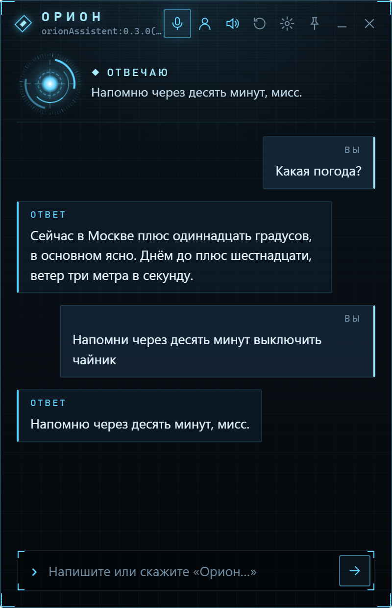
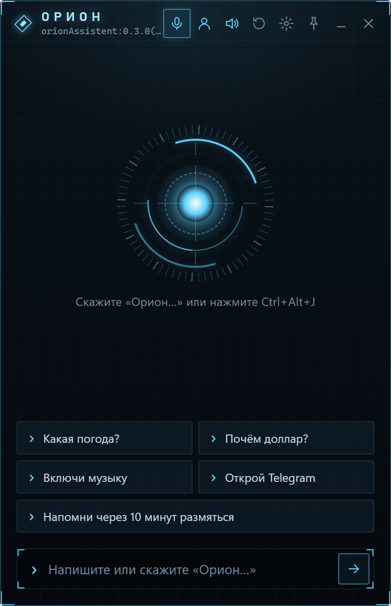
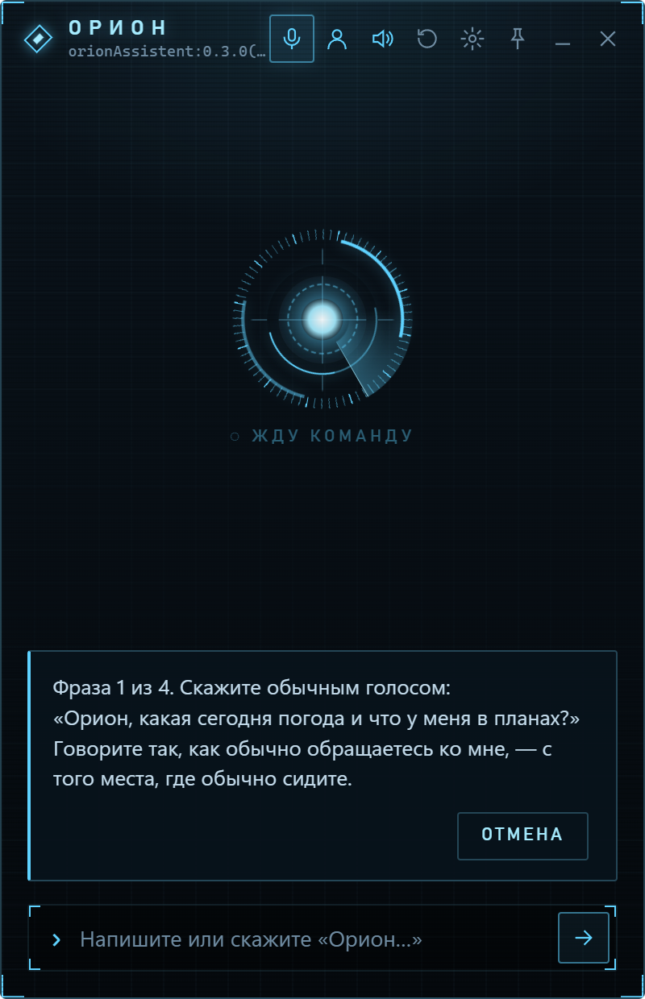
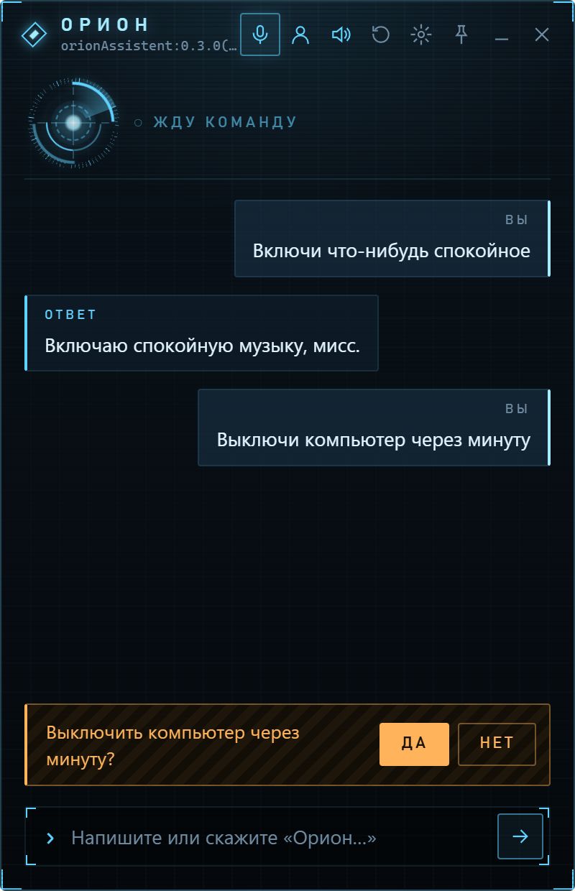
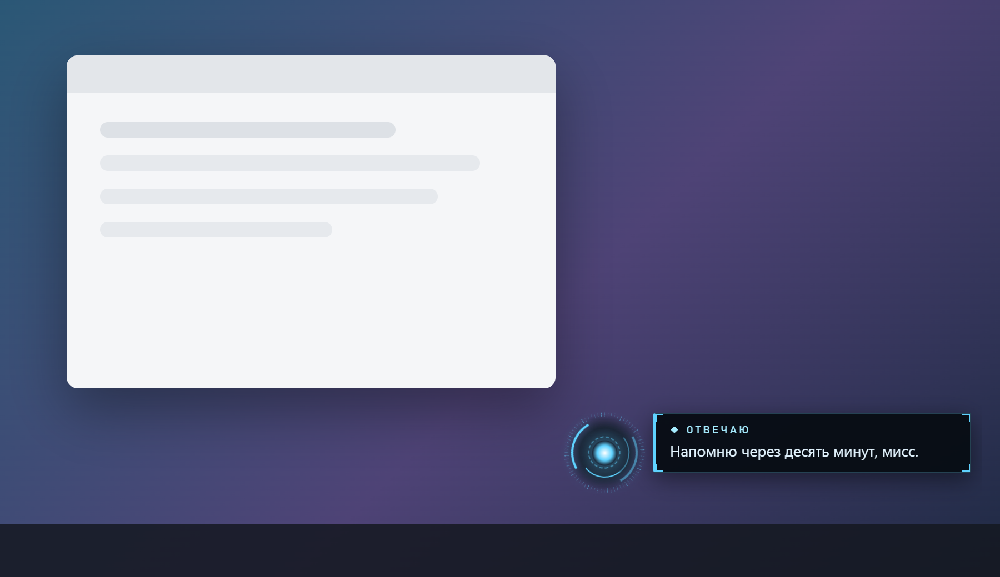
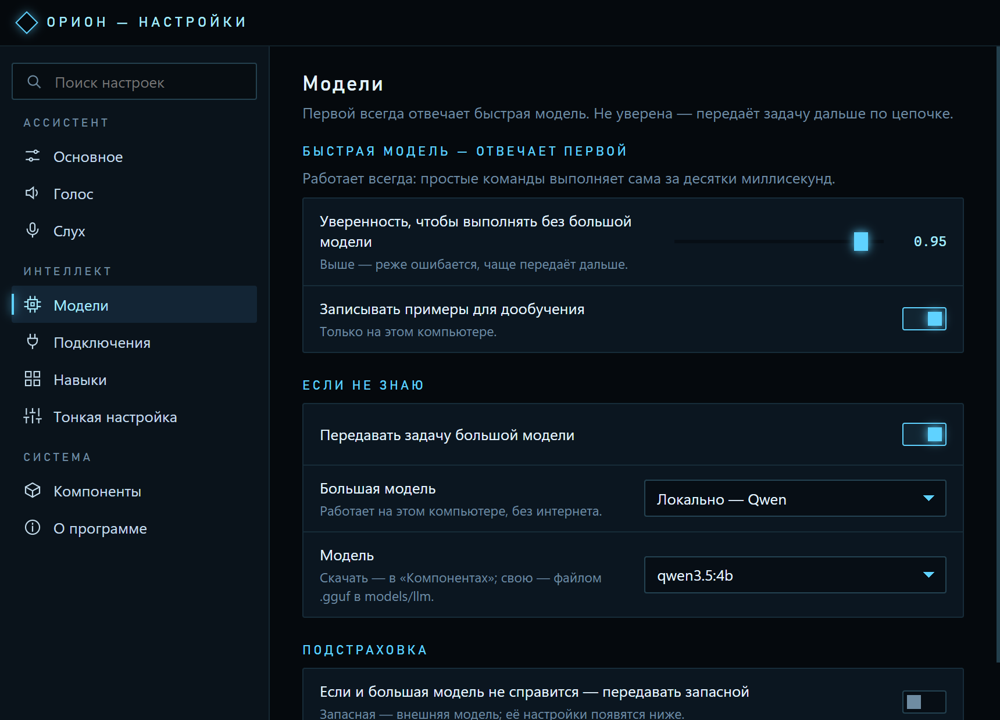
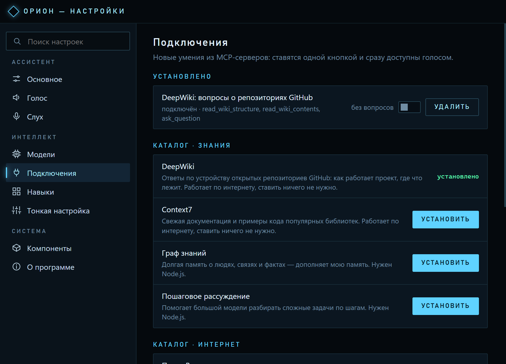

<h1 align="center">Орион</h1>

<p align="center">
  <b>Голосовой помощник в духе Джарвиса, который живёт на вашем компьютере.</b><br>
  Говорит по-русски, узнаёт вас по голосу и думает без облака, аккаунтов и подписок.
</p>

<p align="center">
  <a href="https://github.com/Danik-Off/orion/releases/latest"></a>
  <a href="https://github.com/Danik-Off/orion/actions/workflows/ci.yml"></a>
  
</p>

<p align="center">
  
</p>

Скажите **«Орион, какая погода?»** — и он ответит голосом. **«Напомни через 10 минут про чайник»** — напомнит.
**«Включи Кино, Группа крови»** — найдёт и включит. Орион сидит рядом с часами на панели задач, ничего не делает,
пока его не позовут, и не требует точных формулировок: его можно просить так, как попросили бы человека.

## Чем Орион отличается

- 🔒 **Всё происходит у вас.** Распознавание речи, голос и «мозг» — языковая модель — работают прямо на компьютере.
  Записи голоса и разговоры никуда не отправляются. Регистрация и подписка не нужны.
- 🗣 **Понимает обычную речь.** Не надо заучивать команды: «сделай потише», «а завтра?», «выключи его через час» —
  Орион сам разберётся, что вы имели в виду. На контрольном наборе из ста живых фраз он понимает верно 98%.
- 👥 **Узнаёт, кто говорит.** Запишите голоса всех в семье: к каждому Орион обращается по имени и помнит своё.
  Разговор за соседним столом и телевизор он не слушает.
- ⚡ **Делает, а не только отвечает.** Открывает программы, ставит напоминания, управляет громкостью и музыкой,
  запускает игры из Steam, включает свет через Home Assistant.
- 🧩 **Учится вашим командам.** «Когда я говорю "я дома" — включи джаз и скажи погоду» — и одна фраза запускает
  всю цепочку.
- 🔌 **Новые умения одной кнопкой.** В настройках — магазин подключений (MCP): поиск Brave, браузер, файлы,
  документация и другие серверы ставятся сразу, без перезапуска. Можно подключить и любой свой.
- 📦 **Ставится и удаляется одним файлом.** Всё нужное Орион скачивает сам и заранее показывает, сколько это весит.
  Всё лежит в одной папке рядом с программой и удаляется вместе с ней. Новые версии ставятся сами — Орион
  спросит голосом, обновляться ли.

## Что можно сказать

| | Например |
|---|---|
| 🌤 Погода | «Орион, какая погода?» · «А завтра?» · «Что на выходных в Казани?» |
| 🎵 Музыка и видео | «Включи Кино, Группа крови» · «Включи что-нибудь спокойное» · «Пауза» · «Что сейчас играет?» |
| ⏰ Напоминания | «Напомни через 10 минут про чайник» · «Напомни завтра в 9 позвонить маме» |
| ☀️ Сводка на день | «Доброе утро» — погода, напоминания, дела и главные новости одной репликой |
| 📝 Списки и заметки | «Добавь в покупки молоко и хлеб» · «Что в списке покупок?» |
| 💻 Программы и окна | «Открой Telegram» · «Закрой браузер» · «Сверни все окна» |
| 📁 Файлы | «Что я сегодня скачивал?» · «Открой последний PDF» · «Перескажи договор» · «Перемести его на рабочий стол» · «Сколько места занимают загрузки?» |
| 🔎 Вопросы | «Кто такой Юрий Гагарин?» · «Почём доллар?» · «Сколько будет 15% от 3400?» |
| 📋 Текст | «Переведи, что я скопировал, на английский» · «Перескажи текст из буфера» · «Напечатай: буду через 10 минут» |
| 📰 Новости | «Главные новости» · «Что нового в науке?» |
| 🎮 Игры | «Запусти Deadlock» · «Сколько я наиграл в КС?» |
| 🖥 Компьютер | «Как там мой компьютер?» · «Почему тормозит?» · «Сделай скриншот» · «Какая скорость интернета?» |
| 🏠 Умный дом | «Выключи свет в спальне» · «Какая температура дома?» |
| 🧠 Память | «Запомни, что я живу в Казани» · «Что ты обо мне знаешь?» · «Забудь про стоматолога» |
| 🤖 Задачи агенту | «Напиши скрипт, который переименует фото по дате» · «Оптимизируй код, который я скопировал» · «Как там задача?» — если установлен Claude Code или Codex |
| 💬 Просто поговорить | «Расскажи анекдот» · «Что было в этот день в истории?» · «Что ты умеешь?» |

## Как это выглядит

<table>
  <tr>
    <td align="center"><br><sub>Ждёт, когда позовут</sub></td>
    <td align="center"><br><sub>Запоминает ваш голос за четыре фразы</sub></td>
    <td align="center"><br><sub>Важное — только с вашего «да»</sub></td>
  </tr>
</table>

Когда окно спрятано, Орион отвечает маленькой плашкой в углу экрана — она не мешает работать и сама исчезает:

<p align="center">
  
</p>

## Установка

1. **Скачайте Орион** со страницы [последней версии](https://github.com/Danik-Off/orion/releases/latest):

   | Система | Файл |
   |---|---|
   | Windows 10 и 11 | `Orion-Setup-….exe` |
   | macOS (Apple Silicon и Intel) | `Orion-…-mac-arm64.dmg` или `…-mac-x64.dmg` |
   | Linux | `Orion-….AppImage` или `.deb` |

2. **Запустите и нажмите «Скачать».** Орион покажет, что и сколько весит: около 1 ГБ — голос, слух и быстрые
   команды. Загрузку можно отложить, а если она оборвётся, продолжится с того же места.
   Как только появится голос, Орион представится и скажет, что готовится к работе.
3. **По желанию — сделайте его умнее.** Потом Орион предложит докачать большую языковую модель (Qwen, 2,7 ГБ)
   или подключить внешнюю: Ollama или стороннюю по API. Это можно сделать и позже: «Настройки» → «Модели».

Больше ничего ставить не нужно. Дальше Орион обновляется сам.

**Что нужно:** микрофон и около 4 ГБ свободного места. С видеокартой (NVIDIA, AMD, Intel или Apple) Орион отвечает
заметно быстрее, но работает и без неё.

> **macOS и Linux — пока бета.** Разговор, погода, напоминания, списки, память, новости и музыка работают везде.
> Команды для самой системы — программы, громкость, питание, скриншоты, Steam — пока только в Windows.
> На macOS при первом запуске сделайте правый клик по Orion.app → «Открыть»: сборка не подписана в Apple.

## Как с ним говорить

- **Назовите по имени:** «Орион, какая погода?». Можно сказать просто «Орион», а команду — после сигнала.
- **Горячая клавиша `Ctrl + Alt + J`** или клик по светящемуся кругу — Орион сразу слушает, имя говорить не нужно.
- **Продолжайте разговор.** После ответа несколько секунд можно говорить без имени: «а завтра?», «спасибо».
- **Не торопитесь.** Если вы задумались посреди фразы, Орион дождётся конца.
- **Перебивайте:** «Орион, стоп» — замолчит, бросит ответ и перестанет слушать до следующего «Орион».
  Пока он ждёт продолжения разговора, хватит просто «стоп» или «отбой». `Esc` замолкает, второе нажатие прячет окно.
- **Пишите**, если говорить неудобно, — строка внизу окна.

Выключить компьютер или сделать что-то подобное Орион сначала спросит — ответьте голосом «да» или «нет».

## Что уходит в интернет

Голос, записи, память и сами разговоры остаются на компьютере. В сеть уходят только запросы, которым без неё
не обойтись:

- погода — [Open-Meteo](https://open-meteo.com); курсы — ЦБ РФ и CoinGecko;
- ответы на вопросы — поиск DuckDuckGo и Википедия; новости — ленты новостных сайтов;
- музыка — YouTube; игры — магазин Steam;
- один раз — загрузка моделей (GitHub и Hugging Face); при запуске — проверка новой версии на GitHub;
- только если вы их включили: внешняя модель по API (спрашивает перед каждой отправкой) и подключения MCP
  (сервер работает по своим правилам; действия с последствиями Орион выполняет только с вашего разрешения).

Проверку обновлений можно выключить в настройках. Всё, что Орион делает, записывается в журнал `actions.log`
в папке данных — его можно открыть и посмотреть.

## Настройки

Настройки открываются шестерёнкой в окне или из меню в трее — отдельным окном с разделами и поиском (`Ctrl+F`):
имя помощника (например, «Джарвис» — откликаться он будет на него), город, голос (их десять) и скорость речи,
слух и микрофон, горячая клавиша, модели, подключения, навыки, скачанные компоненты и обновления.

**Модели.** Первой всегда отвечает быстрая маленькая модель. Не уверена — передаёт задачу большой: локально
(Qwen или [Ollama](https://ollama.com)) или глобально — внешней по API (OpenAI-совместимой или Anthropic).
Можно добавить запасную: если и большая не справилась, вопрос уходит ей — с вашего разрешения.

<p align="center">
  
  
</p>

Правый клик по значку Ориона рядом с часами: запуск вместе с системой, микрофон, проверка обновлений, выход.

## Если что-то не так

- **Не откликается на имя.** Нажмите на человечка → «Настроить отклик на имя» и скажите «Орион» три раза: он запомнит,
  как вы его произносите. Горячая клавиша `Ctrl + Alt + J` срабатывает всегда.
- **Пишет «Языковая модель ещё не скачана».** Перезапустите Орион — он докачает с того места, где остановился.
- **Слишком тихо слышит.** В настройках передвиньте «Чувствительность к тихой речи» влево.
- **Запомнил лишнее.** Скажите «Орион, забудь про…» — и он забудет.

## Для разработчиков

Electron; речь — [sherpa-onnx](https://github.com/k2-fsa/sherpa-onnx) (распознавание Zipformer, голос Supertonic 3,
узнавание голоса CAM++, ударения — [silero-stress](https://github.com/snakers4/silero-stress), перенесённый на JS);
языковая модель — Qwen3.5-4B во встроенном [llama.cpp](https://github.com/ggml-org/llama.cpp).
Навык — это один файл: описание для модели, примеры и функция `run`. Добавить свой навык несложно.

```bash
npm install
npm start          # при первом запуске докачает модели
npm test           # быстрые тесты без сети и моделей
npm run check      # линтер (ESLint), оформление (Prettier) и тесты — то же, что проверяет CI
npm run eval       # точность понимания на контрольных фразах с настоящей моделью
```

- [Техническое описание](docs/TECHNICAL.md) — как всё устроено: ключевое слово, узнавание голоса, память, промпт, навыки.
- [Сборка и выпуск версий](docs/RELEASING.md) — CI/CD на GitHub Actions, установщики для трёх ОС, автообновление.
